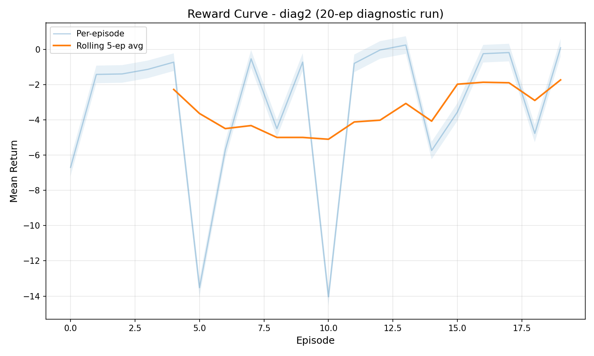

# Role Drift Env

Train a small voice agent to stop drifting out of role — an OpenEnv environment with four programmatic reward signals, validated on real production failures.

## The Problem

I ran a services agency. A client with 500 cold-callers asked me to automate. The LLM was the hard part. Fast small models (Llama 4 Scout) drift — forget instructions, get stuck in thank-you loops, switch languages unprompted. Frontier models (GPT-4, Claude Sonnet) add latency that breaks real-time voice. Every voice-agent company hits this wall.

## The Failure Demo

From a real production deployment (`data/transcripts/masters_union_failure_2.txt`):

> User: I want to go for some education fee. To open institution.
> AI: Got it. It sounds like you're looking for a traditional educational institution...
> User: Give me a good idea for a startup.
> AI: Sure. How about creating an online platform...
> User: What about real estate business?
> AI: Real estate is also a great field...
> User: I want to invest in land.
> AI: You could create a business that focuses on acquiring land parcels, preparing them for development, and selling them to companies or investors.

The agent was supposed to recover an incomplete college application. Instead it became a real estate consultant — after the user said goodbye.

This runs a 3500-word system prompt with 40+ explicit rules. That prompt is in `data/prompts/masters_union_full.md`.

## Four Drift Types

| Drift | Signal | Detection |
|-------|--------|-----------|
| Termination | Agent talks past customer's goodbye | Count turns after farewell |
| Goal | Agent goes off-topic | Embedding similarity to task |
| Instruction | Agent violates prompt rules | Per-rule regex checks |
| Language | Agent switches language unprompted | langdetect |

All detectors validated on real transcripts in `data/transcripts/`.

## Benchmark

See `BENCHMARK.md` for the eval benchmark with leaderboard and CLI interface.

## Pre-Registered Hypotheses

See `docs/hypotheses.md` — results will be reported honestly regardless of outcome.

## Results




Training shown is from a **20-episode diagnostic run (diag2)**. The positive slope (+0.14) and healthy KL (0.06) demonstrate the signal works. Full 100+ episode training is gated on HF compute credits arriving — recipe and pipeline are ready.

## Quick Start

```bash
# Clone and install
git clone https://github.com/anomalyco/role-drift-env.git
cd role-drift-env
pip install -e .

# Run environment
python -c "
from role_drift_env.server.environment import RoleDriftEnvironment
env = RoleDriftEnvironment()
obs, state = env.reset('term_kk_01')
print(f'Loaded: {len(obs.system_prompt)} chars')
"

# Run detectors on a transcript
python tests/test_detectors_on_real_transcripts.py
```

## Known Limitations

- Customer sim requires vLLM server running (Qwen2.5-7B)
- Full training requires GPU compute (100+ ep)
- Instruction rules are per-prompt-domain (extensible but not zero-shot)
- Eval is on 20 scenarios × 3 seeds

## Files

- `data/prompts/` — Production system prompts (6-line simplified + 3500-word full)
- `data/transcripts/` — Real failure transcripts
- `data/scenarios/` — Train/eval scenario definitions
- `role_drift_env/` — Environment code
- `training/` — GRPO trainer + Colab notebook
- `plots/` — Diagnostic run plots

## Links

- Colab notebook: `training/colab_notebook.ipynb`
- Training script: `training/train_grpo.py`
- HF Space: (pending compute to deploy)